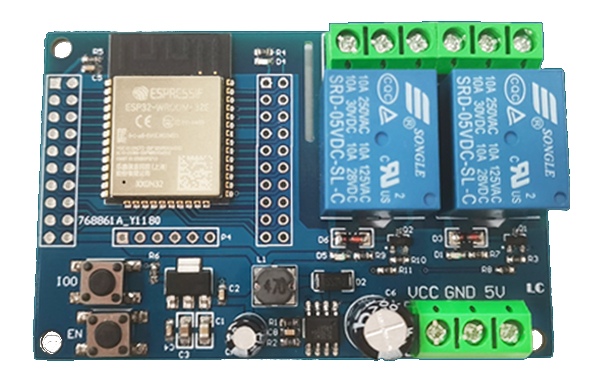
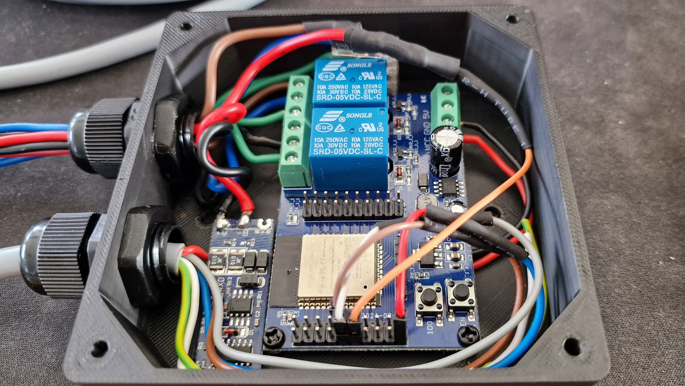
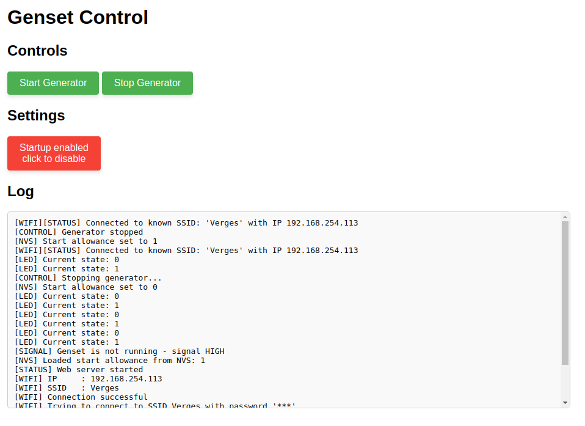

# Genset Control

This project allows you to connect a Victron CerboGX or any other device with a static generator run state to your power generator.
In my case, I use it to start and stop a Cummins Onan MDKDR in my Boat.

## Features

- Connect to your WiFi network an control your Genset from your Mobile Phone using a Browser.
- Update the software using over-the-air updates, available via `/ota`.
- Configure intervals and retry counts to ensure a properly running generator.

## Prerequisites

- Generator to control using dedicated START and STOP relays
- For Cummins Onan MDKDR connection a [Deutsch 8-pin connector](https://www.amazon.de/dp/B0CQR1GXSV)
- Resistor and 3.3V Zener diode to limit the generator running signal
- ESP32 Relais 2 Channel Modul [LC-Relay-ESP32-2R-D5](https://www.amazon.de/dp/B0CYSMFB49) from [OEM](http://www.chinalctech.com/cpzx/Programmer/Relay_Module/518.html)

#### Optional

I maybe integrate Modbus RS485 connectivity for detailed status information about the generator.
To do so, another Module to convert [TTL to RS485](https://www.amazon.de/dp/B09VGJCJKQ) is required.
This module would be connected to the PIN 7 to Modul B- and PIN 8 to Modul B+ of the deutsch connector.

## Required connections

- Connect the START signal from the CerboGX Relay NO (Normally Open) to GPIO PIN 26.
- Connect the STOP signal from the CerboGX Relay NC (Normally Closed) to GPIO PIN 27.
- Power the CerboGX Relay by connecting the 3.3V PIN to the relay's COM (Common) terminal.
- Connect a 3.3V limited running signal (do not use the 12/24V from the generator directly) to GPIO PIN 25. (optional)

### Deutsch 8-pin Cummins Onan Connector

Please verify with your own Generator.

My MDKDR will be connected to:
- Pin 4 to COM of both Relays
- Pin 2 to NO of Relay 2 (closer to the middle)
- Pin 3 to NO of Relay 1 (outer side of the board)
- Pin 6 to GPIO PIN 25 using a 3.3V limiter (example, resistor and zenner diode)
- Pin 7 to TTL-to-RS485 B- (Optional, upcoming feature)
- Pin 8 to TTL-to-RS485 B+ (Optional, upcoming feature)

## Enclosure

To properly install the box, I created a enclosure that can house all components.
You can download and 3D print it yourself from [Onshape](https://cad.onshape.com/documents/9c1b0201fdea620ef028474e/w/3ae20249731e816e0fa28480/e/1f0a333ff2bf13ef2d5e0742?renderMode=0&uiState=6760538337f4be1332ea191f).
In order to properly run the cables, use [PG Cable Glands Screw Joints](https://www.amazon.de/dp/B09MVL78VS).

## Web UI

It's not required to use the WebUI, but it certainly adds some value.

### Wifi Hotspot

The device opens up an WIFI Hotspot with the name `Genset Control`.
After connecting to this wifi using a Laptop or Mobile device, you can open the browser on IP [192.168.4.1](http://192.168.4.1) or if mDNS is working [genset-control.local](http://genset-control.local).
Please reconfigure the WIFI to access your own AP, this is possible with the UI at [192.168.4.1/wifi](http://192.168.4.1/wifi).

## Contributing

Contributions are welcome! If you find any issues or have suggestions for improvements, please open an issue or submit a pull request.

# License

genset-control (c) by Martin Verges.

This project is licensed under a Creative Commons Attribution-NonCommercial-ShareAlike 4.0 International License.

You should have received a copy of the license along with this work.
If not, see <http://creativecommons.org/licenses/by-nc-sa/4.0/>.

## Commercial Licenses 

If you want to use this software on a comercial product, you can get an commercial license on request.
